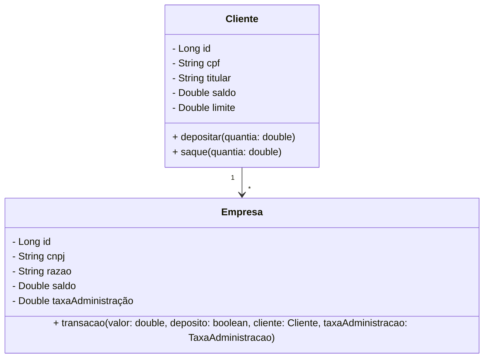

## Teste TGID

Este repositório contém o código desenvolvido para o teste técnico solicitado pela empresa. O projeto foi implementado seguindo as melhores práticas de desenvolvimento, como o uso de princípios de Clean Code para assegurar a legibilidade e simplicidade do código, além de garantir sua fácil manutenção e extensibilidade.
O gerenciamento de dependências foi feito com Maven, o que facilita a integração e a manutenção do projeto.

O código foi versionado utilizando Git e hospedado no GitHub, possibilitando um histórico claro de mudanças e facilitando a colaboração entre desenvolvedores. A documentação do projeto inclui instruções de uso, estrutura, e exemplos de entrada e saída, oferecendo suporte para a correta utilização da solução.

Segue diagrama de classes:

